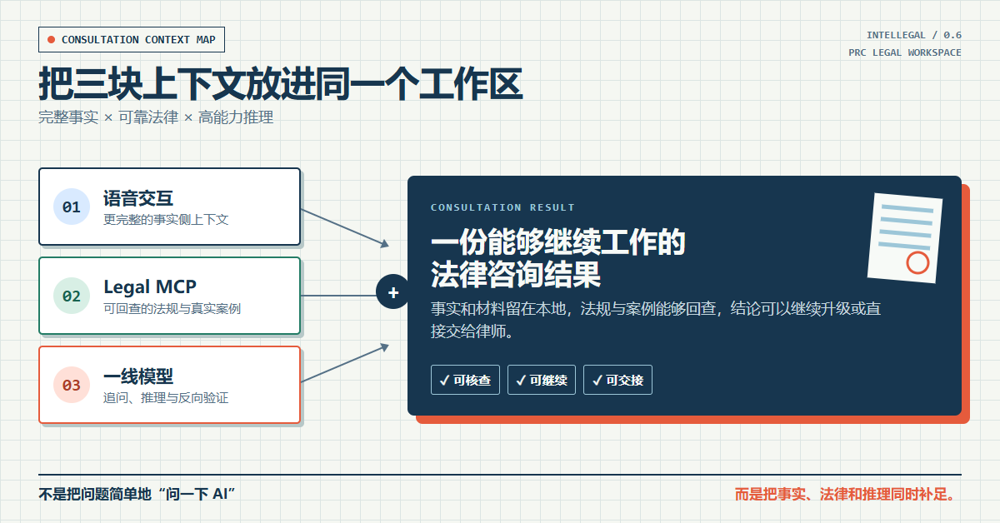

# 基于 GPT Live 的语音交互法律咨询包

优质法律咨询需要三样东西：完整的事实、可靠的法律依据，以及足够强的推理能力。语音交互、Legal MCP 和一线模型，恰好分别补上了这三块。



**语音交互提供充分的事实侧上下文，Legal MCP 提供可回查的法律侧上下文，一线模型负责持续追问、推理和反向验证。**三者在同一个本地工作区里协作，形成一份可核查、可继续、也可以直接交给律师复核的法律咨询结果。

本项目把这套逻辑做成了一个面向中国大陆法律问题的 Codex 本地工作包，串联 GPT Live 语音对话、材料阅读、现行法与案例核查和报告生成。用户不需要先写出完整案情，也不用判断哪些细节“有法律意义”：可以先自然地讲，Agent 每次追问一个最影响判断的问题，同时整理时间线、材料、矛盾、不利事实和待确认事项。基础梳理不要求预先配置检索工具；需要更确定时，再核查法规和真实案例。

## 一句话开始

把下面这句话发给一个空白 Codex 任务：

```text
读 https://github.com/intellegal/ai-native-legal-consultant/blob/main/install.md，帮我进行配置，我需要法律咨询
```

也可以点击[在 Codex 中开始配置](codex://new?prompt=%E8%AF%BB%20https%3A%2F%2Fgithub.com%2Fintellegal%2Fai-native-legal-consultant%2Fblob%2Fmain%2Finstall.md%EF%BC%8C%E5%B8%AE%E6%88%91%E8%BF%9B%E8%A1%8C%E9%85%8D%E7%BD%AE%EF%BC%8C%E6%88%91%E9%9C%80%E8%A6%81%E6%B3%95%E5%BE%8B%E5%92%A8%E8%AF%A2)，再按发送。

Agent 会先建议一个“文档/我的法律咨询”下的新目录，也允许你指定其他位置；确认后自动下载、解压、验证并打开正确的项目。你不需要手动安装 Skill，也不需要在第一次咨询前配置法律 MCP。Codex 仍可能要求你确认文件访问和项目信任。

进入新项目后，可以直接发送“我需要法律咨询”，也可以打开 GPT Live 开始持续语音对话。GPT Live 可能显示为独立窗口；只要它协调的任务绑定在刚才创建的项目目录，就能继续读取材料、使用项目规范并生成文件。

## 咨询怎样推进

```text
先帮我理清 → 按需核查法规与案例 → 必要时交给真人律师复核
```

1. **基础梳理**：通过语音或文字了解情况，逐步确认目标、时间线、材料、矛盾、对方可能的说法和仍会改变判断的未知项，形成基础版咨询结果。到这里已经够用，可以直接停止。
2. **法规与案例核查**：如果你希望确认现行规则、类似判决或反方路径，Agent 会先说明数据和积分边界，再带你配置Legal MCP的法规与案例能力。核查会覆盖支持、相反和可区分的案例，保存取得的裁判全文，并升级同一份咨询结果。
3. **真人复核**：如果事项重大、准备采取不可逆行动，或者核查后仍有困惑，可将项目打包发送给律师进行复核，不必再复述案件。是否联系、接受委托、收费和开始复核，仍以你与律师后续确认的信息为准。

## 你会得到什么

- 一份持续更新的 `004_给你的结果/001_咨询结果.md`，清楚区分用户陈述、材料支持、现行规则、案例观察、条件性判断和待核查问题；
- 保存在本地的材料清单、访谈记录、工作底稿和处理副本，暂停后可以继续，不必重新讲述；
- 进入案例核查后取得的裁判全文 Markdown 文件及索引，报告可以直接链接原文；
- 需要时生成的行动清单和律师复核委托说明。

目录也只有三层需要记住：`002_你的材料/` 放你提供的文件，`003_内部工作区/` 保存 Agent 的工作过程，`004_给你的结果/` 放交付给你阅读或转交的成果。

## 费用、数据和边界

工作包本身免费。AI 套餐、模型用量和可选检索服务可能产生的费用，以你使用的平台当时规则为准；真人律师复核如实际提供，需另行确认范围和报价。

本包不会把对话和文件自动发送给发布方或律师，但 AI、MCP、同步盘和备份服务仍可能按各自条款处理数据。深入核查只应发送完成检索所需的最少事实；MCP Key 默认通过隐藏输入填写，并会明文保存在当前项目的 `.codex/config.toml`，不要公开上传或分享该文件。

本工作包不保证法律判断、案件结果或任何机构采纳分析，也不会自动立案、发函、付款、提交材料或管理期限。涉及正在发生的人身危险、持续资金损失、临近程序期限、证据灭失、重大文件签署或刑事、行政强制措施时，应尽快联系当地紧急服务、相关机关或律师。

详细说明：[进一步核查怎么开启](001_使用说明与配置/002_进一步核查怎么开启.md) · [使用须知与风险声明](001_使用说明与配置/001_使用须知与风险声明.md) · [联系若凡律师](001_使用说明与配置/003_服务提供方信息.md)
